

  A 2048 Prop Game Clone written in Vue by HUST.CS.2108!

# 2048 Prop Game
《2048》在设计之初，是一款单人在线和移动端游戏，游戏任务是在一个网格上滑动小方块来进行组合，直到形成一个带有有数字2048的方块。使用方向键让方块整体上下左右移动。如果两个带有相同数字的方块在移动中碰撞，则它们会合并为一个方块，且所带数字变为两者之和。当值为2048的方块出现时，游戏即胜利。
我们在原有游戏基础上，设计了更加多样化的道具以及具有竞争性的双人对战玩法，实现了在网页端2048类对战游戏，具有网络实时对战功能。

## 立项过程
参会组员：樊磊，王晨，周常禹，杨道文。
参会图
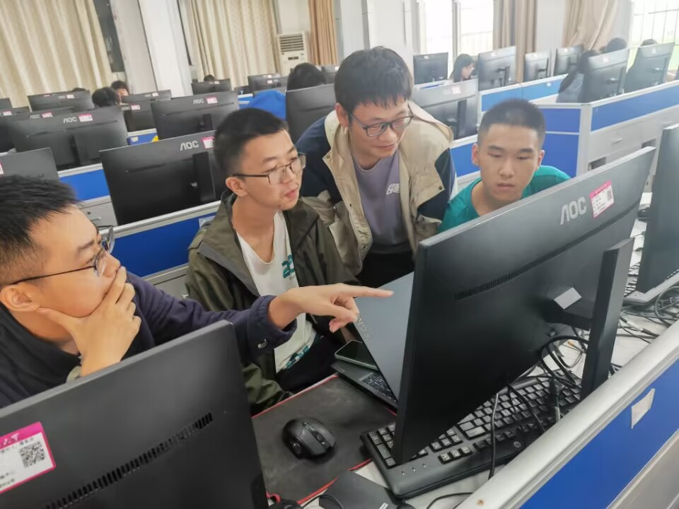
mindmap图
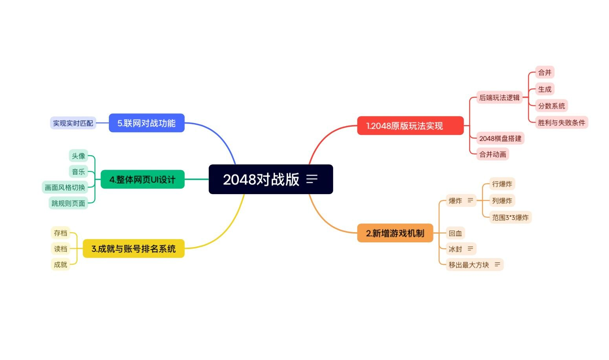

## NABCD模型
N（Need 需求）：玩家用户在进行2048游戏过程中，由于2048本身游戏的休闲性，常常遇到游玩过于随意，无法提高自身技术的情况，同时希望能够加入对手提升游戏的竞争与对抗，因此他们迫切希望可以通过一个方便可靠的网络平台实现网络对战功能；

A(Approach 方法)：我们在原因游戏的基础上加入了对战平台，可以以网络链接的方式邀请他人对战，可以实时观看双方的2048棋盘与分数情况。

B（Benefit 好处）：用户可以通过平台找到对手提升自己的2048水平，同时，我们也在主页加入了2048的攻略以及用户独有的成就功能，鼓励更具实力的玩家。

C(Competitors 竞争)：目前存在许多2048游戏，除了最原始的版本外，还有4D版，5x5棋盘升级到65536版，逆向拆2048版 ，皮肤集合版，我们的游戏在运营初很难得到足够的知名度。

D(Delivery 推广)：用户邀请推荐我们的平台，同时我们也可以在相应的游戏网站进行广告宣传。

## 分析模型构建
游戏用例图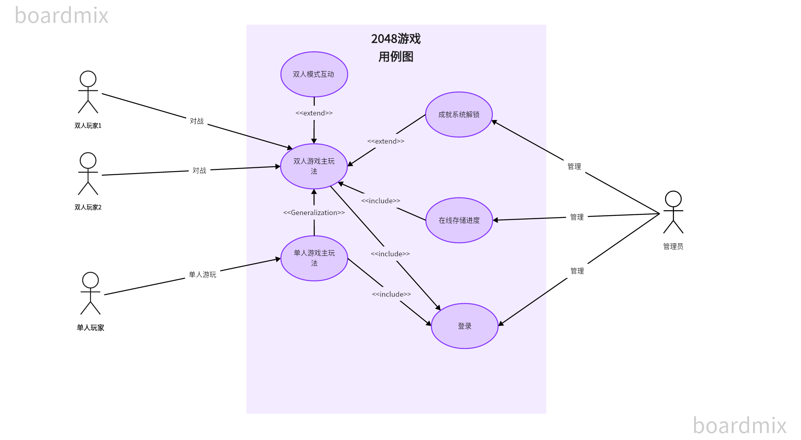
游戏类图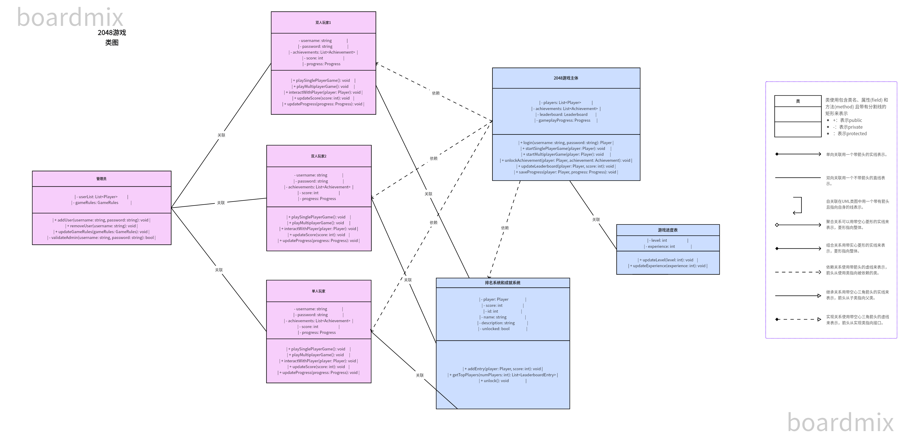
游戏状态图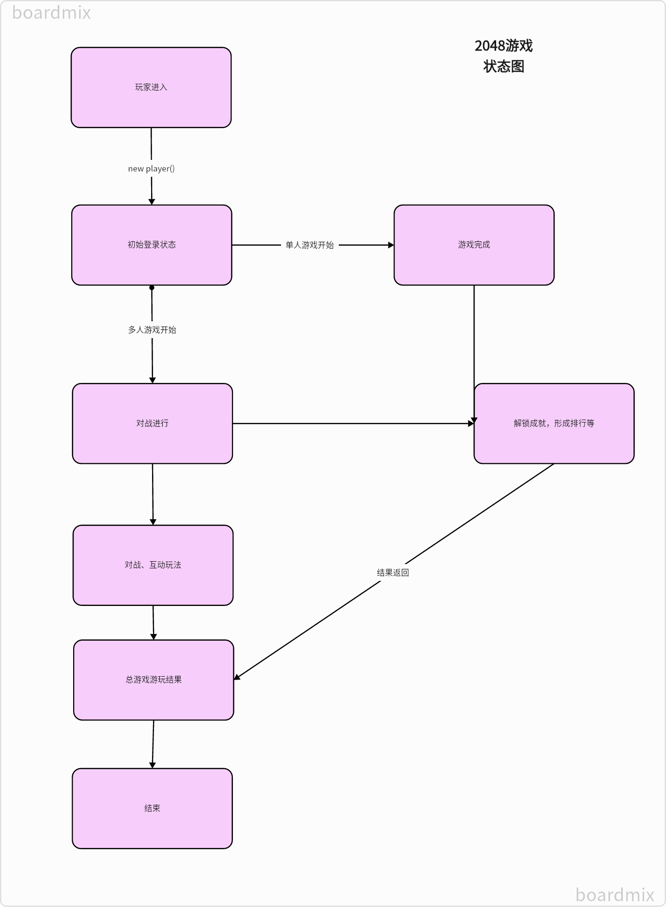
游戏时序图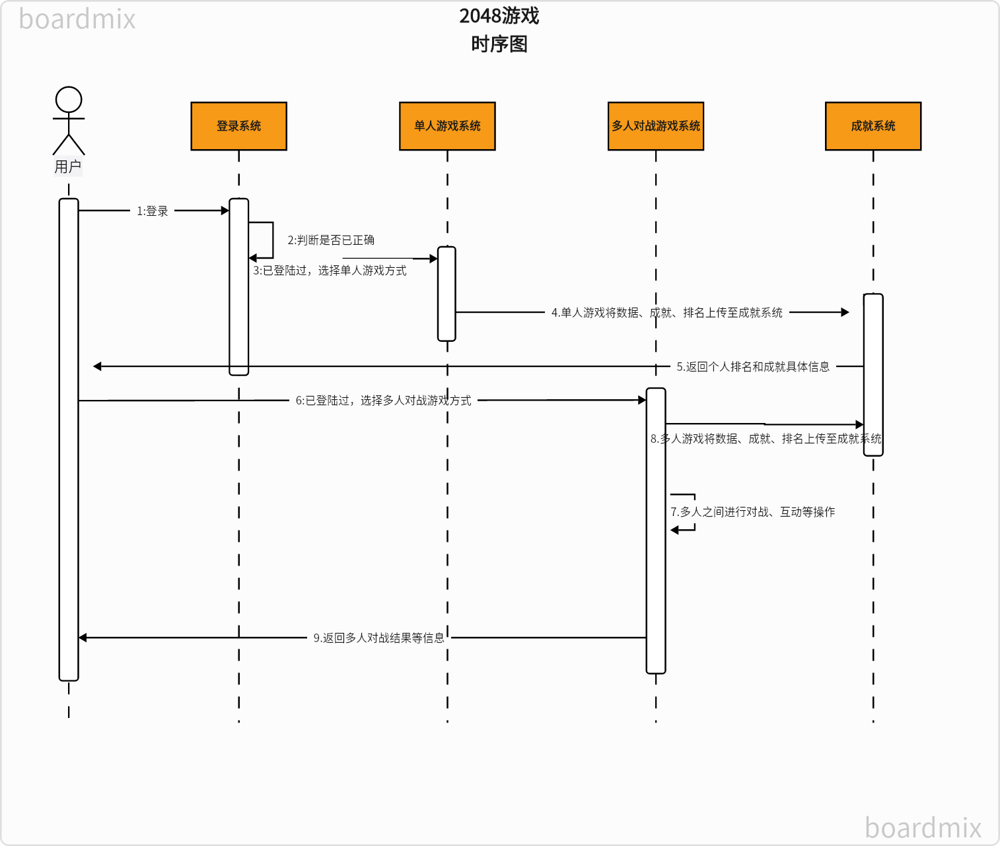

## 原型设计
首页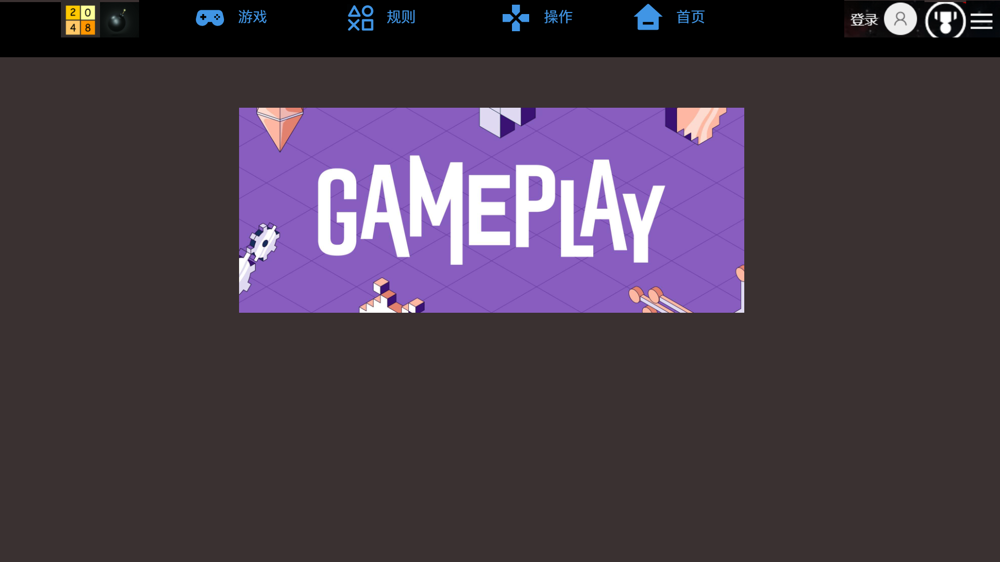
成就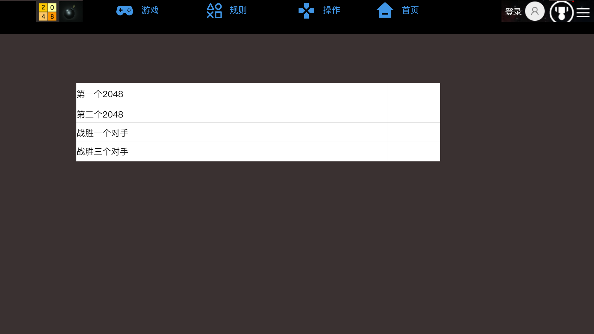
用户登录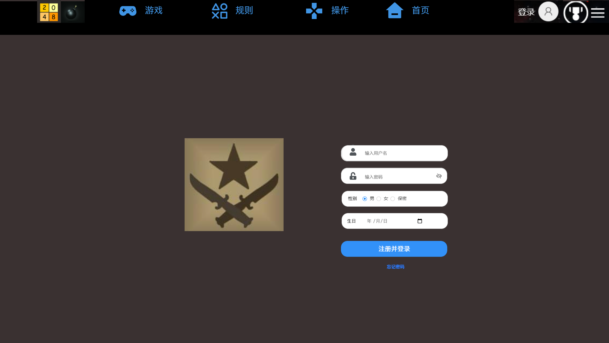
游戏界面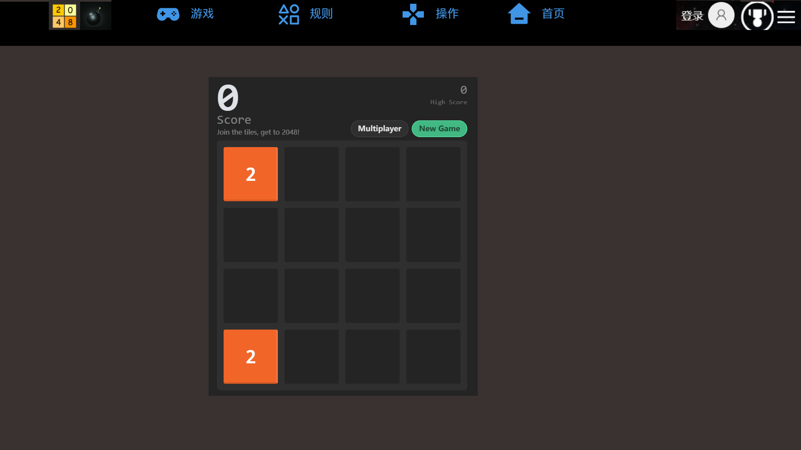
这是我们组在墨刀上实现的原型网站网址：[https://modao.cc/proto/design/pb2lnbl0lizfn8qrl](https://modao.cc/proto/design/pb2lnbl0lizfn8qrl)

## 进度计划
我们根据软件多方面的功能，对项目进行功能分解，按照要求实现了对组成员任务合理的分配，具体分配情况见下图
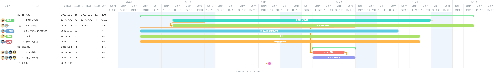
